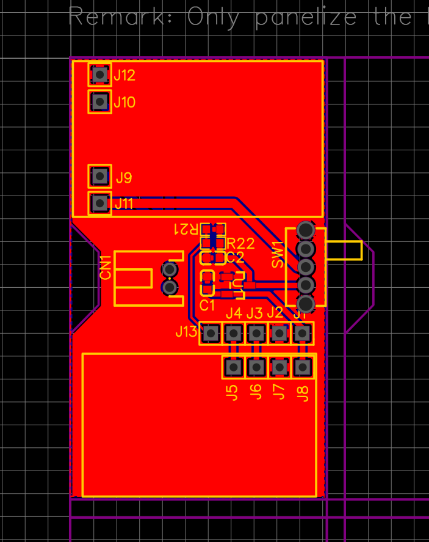
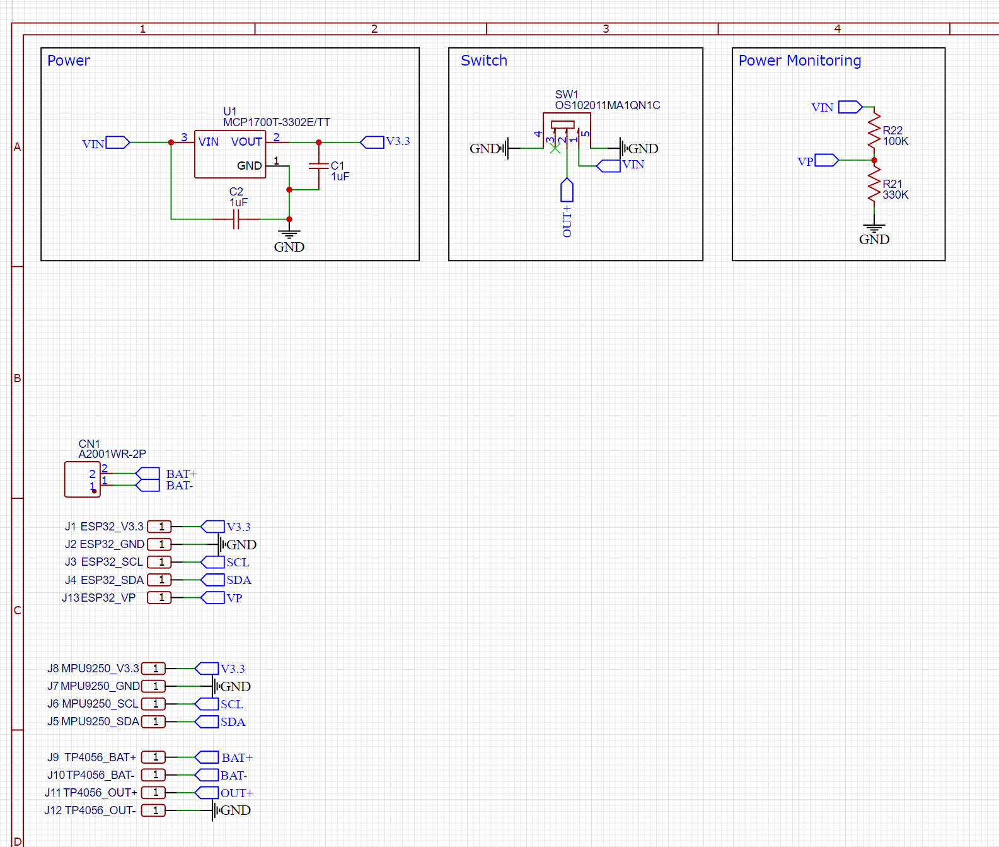

# DIY_Files
CAD, Gerber, Diagrams, Datasheets. Just an accumulation of all the things you might need/want for DIY trackers

# EasyEDA Files

The files in the EasyEDA folder can be dragged into EasyEDA to see the schematic and assembly.

The Gerber, BOM, and Pick-n-Place folders have files exported from the assembly.

You can visit: https://jlcpcb.com/?href=easyeda-home to have your own boards made and sent to you.

# Mounting Board V0.6
This small pcb will help organize your parts. You can fit 6 designs on a single board. So technically, you could get 30 boards for around $12.

# Mounting Board V0.6 Schematic

